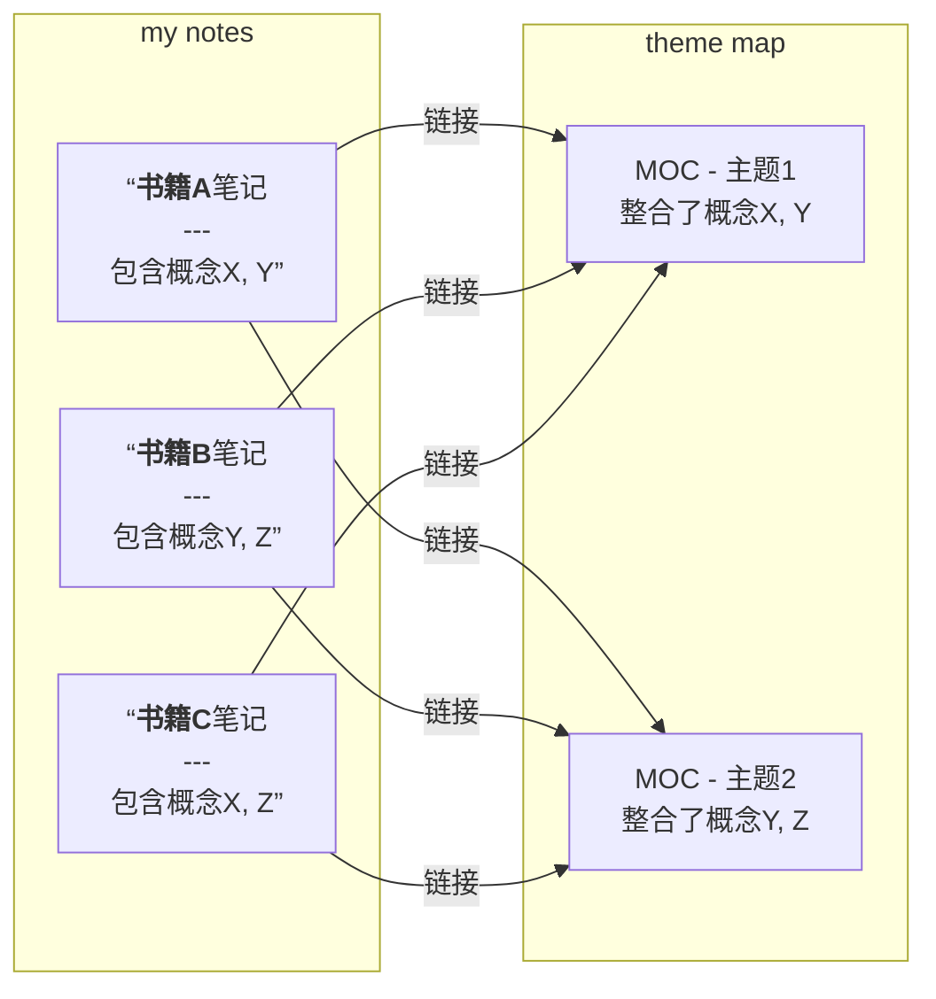

最近我的需求是建立“微信阅读+obsidian”的电子阅读笔记体系。

我个人的习惯是以书本为中心、按章节做笔记，又希望能构建起跨书籍的“主题知识网络”—— 线性+网状的两层结构，我认为MOC+双联可以满足我的需求。
或许用MOC来说明它不是特别准确，因为这一部分我希望是怎么舒服怎么来，不太去想怎么样才能组织成某某知识管理体系架构。
## Measures maybe
我的计划是：为每章阅读创建笔记，再为强相关主题创建专门的地图笔记。

___
## note template
一份阅读笔记模板非常重要，个人的笔记模板很大程度借鉴了[这个 Note Templates](https://github.com/groepl/Obsidian-Templates/blob/main/Templates/3_Note%20Template.md)，非常感谢分享！
### 关于 back matter部分
这一部分的思想是**将“笔记内容本身”和“关于笔记的元数据”清晰分离。**
- **笔记主体**：是我们的思考和知识（`Details`, `Supporting Content`）。
- **Back Matter**：是这些知识的**来源、关联、去向和管理信息**。
把它理解为知识资产的“管理后台”或“溯源档案”。
#### 各部分如何填写呢？
1. Source：知识的源头
	- based_on::主要来源
	- inspired_by:: 灵感或次要来源
	- contradicts::反驳或对立观点来源
2. References：记录与本文核心内容**强相关**的内部笔记链接，并说明关联原因
	- see::链接，原因：xx的基础
	- compare::另一视角
	- supports::某文论点支撑了该笔记中结论
3. Terms：**集中管理本文出现的所有专业术语的定义页。**
4. Target：应用场景和出口，学这个有什么用
	- used_in:: <!-- 用于个人项目 -->
	- cited_in::  <!-- 用于学习/考证计划 -->
	- basis_for::<!-- 作为某份产出报告的基础 -->
5. Tasks：将知识转化为**具体的待办事项**
	- [ ]用python实现...
	- [ ]在colab上搭建...
6. Questions：记录阅读后产生的**新疑问和思考点**，驱动深度学习和研究
	- question::
#### 循序渐进
>这个模板有点太完美了，一开始就all in会有种填表的错觉。
>目前得到的信息告诉我：Dataview和Excalidraw的学习刻不容缓，但查到的教程学习周期都好长。
>实话讲有点稀释阅读、学习热情 /_ \。

为了让自己更好地坚持下去，哪些是必须的呢？
- Source
- Terms
- Questions
- Target

而在知识网络形成后，References可能是最有价值的部分，这个部分可以阶段性地为笔记添加、维护，不急于一时。

>这一部分的服务主体依旧是自己，不要过多纠结是否完美，即使只用到其中的20%，对我的帮助也远超一篇普通的线性笔记了。
## 结语
从开始正式折腾，到现在已经两天了！有感觉到自己在吸收知识并不断调整。Wssxiu Fighting!!!!!